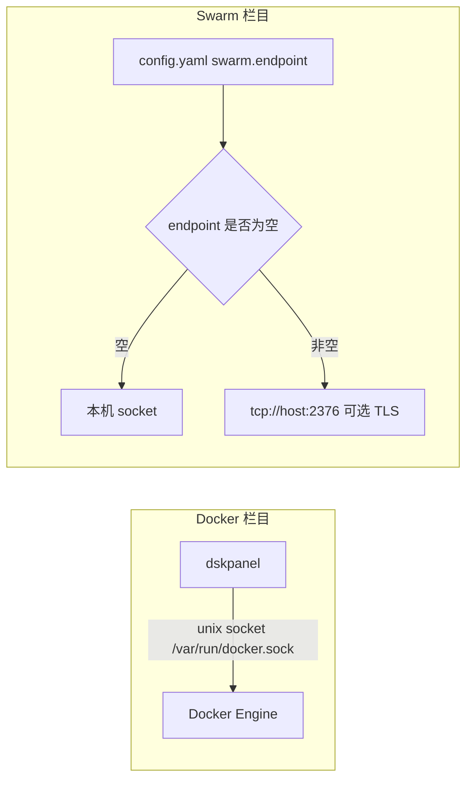

# dskpanel

轻量容器管理工具：单机 Docker + Docker‑Swarm + Kubernetes。

- **Docker**：连接本机 Docker Engine，管理容器 / 镜像 / 网络 / 卷 / Compose 编排。
- **Swarm**：连接目标在 `config.yaml` 的 `swarm` 段配置（`endpoint` 留空连本机，否则连远程 manager，可配 TLS 凭据）。
- **Kubernetes**：连接目标在 `config.yaml` 的 `k8s` 段配置（`kubeconfig` 留空自动检测：InCluster / `~/.kube/config`），管理节点 / Pod / 工作负载 / Service / 配置 / 事件，支持 YAML 透传。

---

## 功能特性

### Docker 单机

- 概览：资源统计、引擎信息、磁盘占用汇总与**趋势图**（metric 每 60s 采集）、一键清理
- 容器：列表 / 创建（SpecEditor 表单 + YAML 双模式）/ 启停 / 重启 / 删除 / 暂停 / 重命名 / 更新 / 提交 / 导入导出 / 批量操作 / 实时日志 / 终端 / **资源监控趋势图**（CPU / 内存 / 网络 / 磁盘）
- 镜像：拉取 / 推送 / 打标签 / 删除 / 批量删除 / 导出导入 / **层历史（LAYERS）** / 多平台架构 / 一键清理
- 网络：列表 / 创建 / 连接容器 / 清理
- 卷：列表 / 创建 / 详情（含**使用该卷的容器**）/ 清理
- Compose 编排：模板库 / 校验 / **SSE 流式部署回显** / 项目列表（启停 / 重启 / down / 日志 / 详情）
- **系统事件实时流**：活动通知抽屉「我的操作 / 系统事件」双 Tab，实时推送容器 / 镜像 / 网络 / 卷等 daemon 事件

### Swarm

- 概览：集群状态、统计卡、节点 / 任务状态分布；未启用时展示**启动 / 加入节点 / 关闭**引导命令（可复制）
- 节点：列表 / 详情 / 可用性切换（active / pause / drain）/ 删除 / join token
- 服务：创建（**多服务 Tabs + 表单 / YAML 双模式**）/ 更新 / 伸缩 / 回滚 / 强制更新 / 删除 / 任务列表 / 日志 / **任务容器资源监控**（CPU / 内存聚合）/ 详情
- 网络、Secret、Config 管理

### Kubernetes

- 概览：集群状态、统计卡、Pod 阶段分布、节点 / 资源数量汇总
- 节点：列表 / 详情（资源使用率、标签、污点）/ Cordon / Uncordon / 驱逐（Drain）
- Pod：列表（命名空间切换）/ 详情（容器状态、exec 命令）/ **SSE 实时日志** / 删除
- 工作负载：Deployment / StatefulSet / DaemonSet 列表（命名空间切换）+ YAML 详情 + 伸缩 + 重启 + 删除
- 服务：Service / Ingress 列表（类型、端口、域名）+ YAML 详情 + 删除
- 配置：ConfigMap / Secret 列表（脱敏）+ YAML 详情 + 删除
- 事件：集群事件列表（类型 / 原因 / 对象）
- **YAML 透传**：模板库 + 多文档 apply / delete（`kubectl` 语义）+ 服务端 DryRun 校验

---

## 技术栈

| 层 | 技术 |
|---|---|
| 后端 | Go + [infra-go](https://github.com/chihqiang/infra-go)（conf / logger / orm / httpx）、[moby SDK](https://github.com/moby/moby)（Docker API）、[docker/compose](https://github.com/docker/compose)（Compose SDK）、GORM + SQLite |
| 前端 | Vue 3.5 + TypeScript + Vite 7 + Tailwind v4 + Pinia + Vue Router + ECharts + xterm.js（终端）+ yaml |

---

## 目录结构

```
dskpanel/
├── config/            # 配置结构体（config.yaml 映射）
├── config.yaml        # 应用配置（端口 / 认证 / 指标 / Swarm 等）
├── db/                # 数据库迁移（SQLite：NodeMetric / PodMetric）
├── handler/           # HTTP 处理器（路由 → Logic）
├── logic/             # 业务逻辑（Docker / Container / Image / Network / Volume / Compose / Swarm / Metric / Auth）
├── middleware/        # 鉴权等中间件
├── model/             # 数据模型
├── route/             # 路由注册
├── svc/               # 依赖装配（AppContext）
├── main.go            # 启动入口
└── ui/                # Vue 前端
    └── src/
        ├── api/       # 后端 API 封装（含 SSE / 流式）
        ├── components/ # 通用组件（DataTable / SpecEditor / Modal 等）与业务弹窗
        ├── composables/ # 可组合逻辑（toast / confirm / clipboard 等）
        ├── stores/    # Pinia（auth / activity / dockerEvents）
        ├── templates/ # YAML 模板库（serviceSpec / compose）
        ├── utils/     # 工具（format / docker 状态映射）
        └── views/     # 页面（docker / swarm / k8s）
```

---

## 快速开始

### 后端

```bash
# 依赖 Go 1.22+，本机需可用 Docker Engine
go run .                 # 读取 config.yaml，监听 8080
# 或指定配置
go run . -c /path/to/config.yaml
```

### 前端（开发）

```bash
cd ui
npm install
npm run dev              # http://localhost:5173（/api 代理到 8080）
```

### 生产构建

```bash
go build -o dskpanel .   # 后端二进制
cd ui && npm run build   # 前端产物 → ui/dist（可交由后端托管或独立部署）
```

默认账号：`admin / admin123`（`config.yaml` 中可改）。

---

## 配置说明（config.yaml）

```yaml
app:
  name: dskpanel

server:
  host: 0.0.0.0
  port: 8080

db:
  driver: sqlite
  database: /tmp/dskpanel/dskpanel.db   # 指标数据存这里

auth:
  secret: dskpanel-change-me            # token 签名密钥（生产用环境变量覆盖）
  token_ttl: 24h
  username: admin
  password: admin123

metric:
  enabled: true                        # 指标采集（趋势图数据源）
  resolution: 60s                      # 采集间隔
  duration: 7200s                      # 数据保留时长

deploy:
  dir: /tmp/dskpanel/deploy            # Compose 文件备份目录

swarm:
  endpoint: ""                          # 留空 = 连本机；填 tcp://host:2376 连远程 manager
  ca: ""                                # TLS 凭据（PEM，可选）
  cert: ""
  key: ""
```

敏感项（`auth.secret`、`swarm.*` 等）可用环境变量覆盖（`conf.UseEnv()`）。

---

## 连接架构



- **Docker**：固定连本机（`client.FromEnv`，默认 `unix:///var/run/docker.sock`），无需配置。
- **Swarm**：单一目标，由 `config.yaml` 的 `swarm` 段决定；本机模式要求已启用 swarm mode 且为 manager。

---

## 主要 API 一览

| 模块 | 端点 |
|---|---|
| 认证 | `POST /api/v1/auth/login` |
| Docker | `GET /docker/detect` `/docker/overview` `/docker/info` `POST /docker/prune` `GET /docker/events`(SSE) |
| 容器 | `GET/POST /containers`、`/containers/{id}` 详情/启停/重启/删除/更新/提交、`/containers/batch`、`/containers/{id}/logs`(SSE) `/terminal` `/stats` |
| 镜像 | `GET/POST /images`、`/images/pull`(SSE) `/push` `/tag` `/prune` `/remove` `/export` `/import` `/disk-usage`、`/images/{id}` 详情 |
| 网络 / 卷 | `/networks`（列表/创建/连接/断开/清理）、`/volumes`（列表/创建/详情/清理） |
| Compose | `/compose/validate`、`/compose/deploy`(SSE)、`/compose/projects` 及其 `/start` `/stop` `/restart` `/down` `/logs` `/ps` |
| Swarm | `/swarm/detect` `/overview`、`/nodes`、`/services`（含 `/scale` `/rollback` `/force-update` `/resources`）、`/networks` `/secrets` `/configs` `/join-tokens`、日志 SSE |
| 指标 | `GET /metrics/nodes` |

> 所有业务端点需 `Authorization: Bearer <token>`；SSE 端点用于日志、部署回显与系统事件。

---

## 许可证

[Apache License 2.0](LICENSE) Copyright 2026 chihqiang